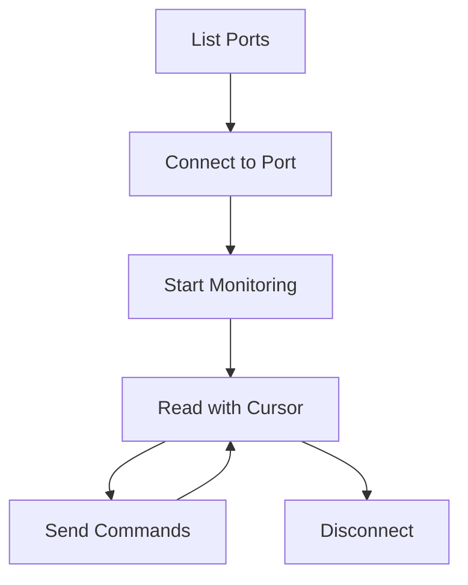

# 🚀 Serial Monitor Integration Guide

## Quick Start

### 1. Install Dependencies

```bash
# Using uv (recommended)
uv pip install pyserial pyserial-asyncio

# Or with pip
pip install pyserial==3.5 pyserial-asyncio==0.6
```

### 2. Configure MCP Client

Add to your Claude Desktop or MCP client configuration:

```json
{
  "mcpServers": {
    "arduino": {
      "command": "uv",
      "args": ["run", "mcp-arduino-server"],
      "env": {
        "ARDUINO_SKETCHES_DIR": "~/Documents/Arduino_MCP_Sketches",
        "ARDUINO_SERIAL_BUFFER_SIZE": "10000"
      }
    }
  }
}
```

#### Environment Variables

- `ARDUINO_SERIAL_BUFFER_SIZE`: Maximum entries in circular buffer (100-1000000, default: 10000)
  - Increase for high-speed data logging (e.g., 50000)
  - Decrease for memory-constrained systems (e.g., 1000)

### 3. Basic Usage Flow



## 🎯 Common Use Cases

### ESP32 Development Workflow

```python
# 1. Upload sketch
await arduino_upload_sketch(
    sketch_name="ESP32_Demo",
    port="/dev/ttyUSB0"
)

# 2. Monitor output
await serial_connect(
    port="/dev/ttyUSB0",
    baudrate=115200
)

# 3. Read boot sequence
cursor = await serial_read(
    port="/dev/ttyUSB0",
    create_cursor=True
)

# 4. Debug with serial output
while developing:
    data = await serial_read(cursor_id=cursor['cursor_id'])
    analyze_output(data)
```

### Arduino Debugging

```python
# Connect with exclusive access
await serial_connect(
    port="/dev/ttyACM0",
    baudrate=9600,
    exclusive=True  # Ensures no conflicts
)

# Send debug commands
await serial_send(
    port="/dev/ttyACM0",
    data="DEBUG_MODE=1"
)

# Monitor debug output
debug_data = await serial_read(
    port="/dev/ttyACM0",
    type_filter="received"
)
```

### Automated Testing

```python
async def test_board_response():
    # Reset board
    await serial_reset_board(port=port, method="dtr")

    # Wait for boot
    await asyncio.sleep(2)

    # Send test command
    response = await serial_send(
        port=port,
        data="TEST",
        wait_response=True,
        timeout=5.0
    )

    assert response['success']
    assert "OK" in response['response']
```

## 📊 Data Flow Architecture

```
User Input → MCP Tool → SerialManager → pyserial-asyncio → Device
                ↓                              ↑
            DataBuffer ← Listener ← StreamReader ←
                ↓
            Cursor API → User Output
```

## ⚡ Performance Optimization

### High-Speed Data Streaming

```python
# For high-speed data (>100Hz)
# 1. Use larger buffer limits
data = await serial_read(limit=500)

# 2. Disable auto-monitor briefly
await serial_connect(port=port, auto_monitor=False)
# ... perform operation
await serial_connect(port=port, auto_monitor=True)

# 3. Clear buffer periodically
await serial_clear_buffer(port=port)
```

### Multiple Device Monitoring

```python
# Efficient multi-port monitoring
ports = await serial_list_ports(arduino_only=True)
cursors = {}

# Initialize all connections
for port_info in ports['ports']:
    port = port_info['device']
    await serial_connect(port=port)
    result = await serial_read(port=port, create_cursor=True)
    cursors[port] = result['cursor_id']

# Round-robin reading
while True:
    for port, cursor_id in cursors.items():
        data = await serial_read(cursor_id=cursor_id, limit=10)
        if data['count'] > 0:
            process_port_data(port, data['entries'])
    await asyncio.sleep(0.1)
```

## 🔧 Advanced Configuration

### Custom Connection Parameters

```python
# For non-standard devices
await serial_connect(
    port="/dev/ttyS0",
    baudrate=921600,  # High-speed UART
    auto_monitor=True,
    exclusive=True
)
```

### Error Handling

```python
try:
    await serial_connect(port=port)
except Exception as e:
    # Check state for error details
    state = await serial_monitor_state()
    error = state['connections'][port]['error']
    handle_connection_error(error)
```

## 🎮 Interactive Terminal Example

```python
async def interactive_terminal(port: str):
    """Create an interactive serial terminal"""

    # Connect
    await serial_connect(port=port)
    cursor = await serial_read(port=port, create_cursor=True)

    # Read loop in background
    async def read_loop():
        while True:
            data = await serial_read(
                cursor_id=cursor['cursor_id'],
                limit=10
            )
            for entry in data['entries']:
                if entry['type'] == 'received':
                    print(f"< {entry['data']}")
            await asyncio.sleep(0.1)

    # Start reader
    asyncio.create_task(read_loop())

    # Write loop
    while True:
        cmd = input("> ")
        if cmd == "exit":
            break
        await serial_send(port=port, data=cmd)
        print(f"> {cmd}")

    await serial_disconnect(port=port)
```

## 📈 Monitoring Dashboard

```python
async def dashboard():
    """Simple monitoring dashboard"""

    while True:
        # Clear screen
        print("\033[2J\033[H")

        # Get state
        state = await serial_monitor_state()

        print("=== Serial Monitor Dashboard ===")
        print(f"Connected Ports: {len(state['connected_ports'])}")
        print(f"Buffer Entries: {state['buffer_size']}")
        print(f"Active Cursors: {state['active_cursors']}")
        print("\nConnections:")

        for port, info in state['connections'].items():
            print(f"  {port}:")
            print(f"    State: {info['state']}")
            print(f"    Baud: {info['baudrate']}")
            print(f"    Last: {info['last_activity']}")

        await asyncio.sleep(1)
```

## 🐛 Common Issues & Solutions

| Issue | Solution |
|-------|----------|
| "Port busy" | Use `exclusive=True` or check with `lsof` |
| "Permission denied" | Add user to `dialout` group (Linux) |
| "Data corrupted" | Check baudrate matches device |
| "Missing data" | Increase buffer limit or read frequency |
| "Cursor not found" | Create new cursor or check cursor_id |

## 🔗 Integration with Other Tools

### With Arduino Sketch Upload
```python
# Upload and immediately monitor
await arduino_upload_sketch(sketch_name="MySketch", port=port)
await serial_connect(port=port, baudrate=115200)
```

### With Debug Sessions
```python
# Start debug session with serial monitor
debug_id = await arduino_debug_start(sketch_name="MySketch", port=port)
await serial_connect(port=port)  # Monitor debug output
```

### With WireViz Diagrams
```python
# Generate circuit diagram
await wireviz_generate_from_description(
    description="ESP32 with serial connection to PC"
)
# Then connect and test the actual circuit
await serial_connect(port="/dev/ttyUSB0")
```

## 📚 Resources

- [Serial Monitor API Docs](./SERIAL_MONITOR.md)
- [PySerial Documentation](https://pyserial.readthedocs.io)
- [ESP32 Serial Guide](https://docs.espressif.com/projects/esp-idf/en/latest/esp32/api-reference/peripherals/uart.html)
- [Arduino Serial Reference](https://www.arduino.cc/reference/en/language/functions/communication/serial/)

## 💡 Tips & Tricks

1. **Auto-detect Arduino boards**: Use `arduino_only=True` in `serial_list_ports`
2. **Timestamp everything**: All entries include ISO-8601 timestamps
3. **Use cursors for long sessions**: Prevents re-reading old data
4. **Monitor state regularly**: Check connection health with `serial_monitor_state`
5. **Reset on issues**: Use `serial_reset_board` to recover from hangs

## 🎉 Complete Example

```python
async def complete_esp32_workflow():
    """Full ESP32 development workflow with serial monitoring"""

    print("🔍 Discovering ESP32...")
    ports = await serial_list_ports(arduino_only=True)

    if not ports['ports']:
        print("❌ No Arduino devices found!")
        return

    port = ports['ports'][0]['device']
    print(f"✅ Found ESP32 on {port}")

    print("📡 Connecting...")
    await serial_connect(port=port, baudrate=115200)

    print("🔄 Resetting board...")
    await serial_reset_board(port=port)

    print("📖 Reading boot sequence...")
    cursor = await serial_read(port=port, create_cursor=True, limit=50)

    for entry in cursor['entries']:
        if 'ESP32' in entry.get('data', ''):
            print(f"  {entry['data']}")

    print("💬 Sending test command...")
    await serial_send(port=port, data="HELLO ESP32")

    print("📊 Monitoring for 10 seconds...")
    end_time = time.time() + 10
    while time.time() < end_time:
        data = await serial_read(cursor_id=cursor['cursor_id'], limit=10)
        for entry in data['entries']:
            if entry['type'] == 'received':
                print(f"  < {entry['data']}")
        await asyncio.sleep(0.5)

    print("🔌 Disconnecting...")
    await serial_disconnect(port=port)
    print("✨ Complete!")

# Run it!
asyncio.run(complete_esp32_workflow())
```